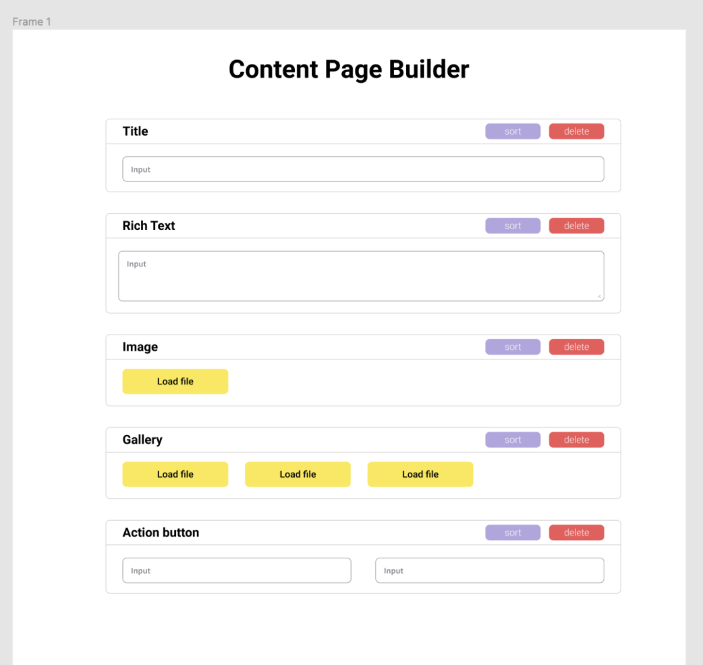
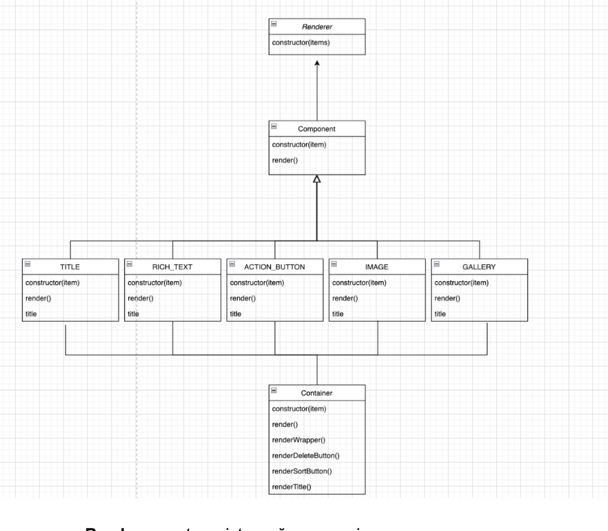

# HW5
Homework HW5 consists of the one task.
Topics : JS, Classes, OOP, Modules, HTML5, CSS3.

## Getting started
We will use Parcel for the local depelopment. Follow [the link](https://parceljs.org/getting-started/webapp/) for getting more details

0. Make sure you've installed nodeJS on your system
1. run command `npm install`
2. run command `npm run start`
3. open http://localhost:1234/ in your browser to see the result

### Source files explanation
- `scripts/app.js` is your main JS file. The other js files will be imported into it
- `styles/app.css` is your main CSS file. All styles should be put into this file
- `index.html` includes basic markup you need for developing the app. Normally you don't need to change the file

## Завдання
Створити рендерер який
- на вході отримує масив з даними для компонентів
- обробляє його
- на виході видає білдер контент сторінки

## Вимоги
- HTML/CSS: мінімальні, але достатні для комфортного перегляду результату
- JS: програма побудована на класах, використано прототипне наслідування, функціонал рознесено по модулях  

### Input sources

    
db.json

- `COMPONENTS_LIST` масив з об’єктами Components
- Component item:
  - заголовок
  - дані для компоненту
- Types of components
  - TITLE
  - RICH_TEXT
  - IMAGE
  - GALLERY
  - ACTION_BUTTON

 

   
Дизайн

  

 

  
Орієнтовна структура класів

  

- `Renderer` - entry point, приймає на вхід масив
- `Component` резолвить конкретний тип компоненту
- `[COMPONENT_TYPE]` імплементація рендерінгу конкретного компоненту
- `Container` - враппер з кнопками DELETE і SORT та заголовком

- Поля для компонентів
  - TITLE
    - text: input, type=text
  - RICH_TEXT
    - text: textarea
  - IMAGE
    - path: input, type=file
  - GALLERY
    - images: multi IMAGE
  - ACTION_BUTTON
    - name: input, type=text
    - url: input, type=url

### Info sources
- [learn.javascript.ru](https://learn.javascript.ru/import-export)
- [developer.mozilla.org modules guide](https://developer.mozilla.org/en-US/docs/Web/JavaScript/Guide/Modules)
- [import](https://developer.mozilla.org/en-US/docs/Web/JavaScript/Reference/Statements/import)
- [export](https://developer.mozilla.org/en-US/docs/Web/JavaScript/Reference/Statements/export)

